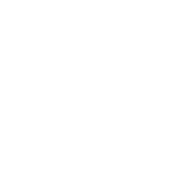
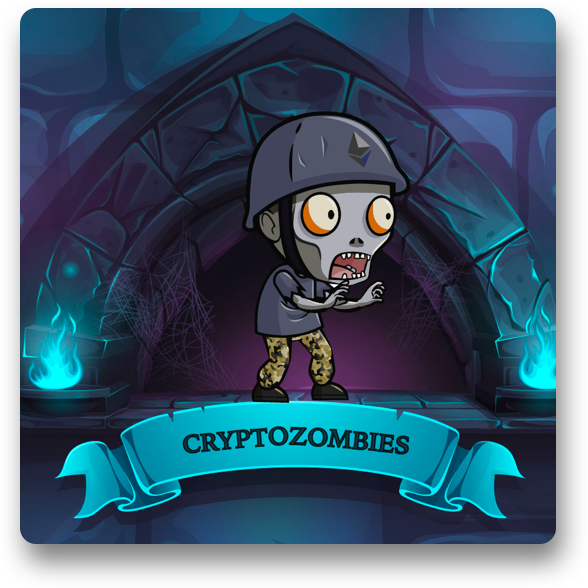

<h1 align="center"><b>Hey my name is Wyv3rn ! 🕵️</b></h1>

## Stats 📈

               

## Languages 🎯

      
 

## Tools 🛠

  

## Ranks 🌌

<table align="center">
                <tr>
                    <td align="center">⤳ TryHackMe:</td>
                    <td align="center"></td>
                    <td align="center"></td>
                </tr>
                <tr>
                    <td align="center">⤳ RootMe:</td>
                    <td align="center"></td>
                    <td align="center"><a href="https://www.root-me.org/Wyv3rn-608084">MY PROFILE</a></td>
                </tr>
                <tr>
                    <td align="center">⤳ Ozint.eu:</td>
                    <td align="center"></td>
                    <td align="center"><a href="https://ozint.eu/ozinter/8407/">MY PROFILE</a></td>
                </tr>
                <tr>
                    <td align="center">⤳ CryptoZombie:</td>
                    <td align="center"></td>
                    <td align="center"></td>
                </tr>
                <tr>
                    <td align="center">⤳ Pwn.college:</td>
                    <td align="center"></td>
                    <td align="center"></td>
                </tr>
            </table>
